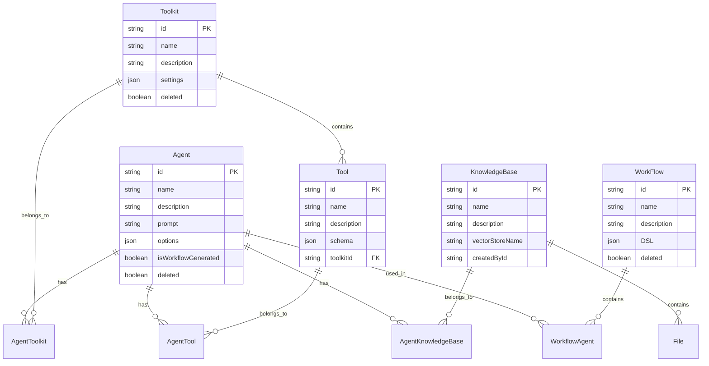

# 智能体平台后端架构设计文档

## 目录

- [系统概述](#系统概述)
- [核心架构](#核心架构)
- [数据模型设计](#数据模型设计)
- [核心模块详解](#核心模块详解)
- [设计模式与最佳实践](#设计模式与最佳实践)
- [扩展性考虑](#扩展性考虑)

---

## 系统概述

### 1. 技术栈

- **框架**: NestJS (基于 Express)
- **数据库**: PostgreSQL + pgvector (向量扩展)
- **ORM**: Prisma
- **AI 集成**: LlamaIndex
- **语言**: TypeScript

### 2. 核心功能

```typescript
// 主要模块导入 (apps/agent-api/src/app.module.ts)
@Module({
  imports: [
    ConfigModule.forRoot({ isGlobal: true }),
    PrismaModule,        // 数据库连接
    ToolsModule,         // 工具系统
    WorkflowModule,      // 工作流引擎
    AgentModule,         // 智能体管理
    LlamaIndexModule,    // AI 引擎
    KnowledgeBaseModule, // 知识库
    HealthModule,        // 健康检查
  ],
})
```

### 3. 系统特点

- **模块化设计** - 各功能模块独立，职责清晰
- **事件驱动** - 工作流基于事件总线异步执行
- **插件化扩展** - 工具包系统支持动态发现和注册
- **向量化检索** - 集成 LlamaIndex 支持 RAG

---

## 核心架构

### 1. 分层架构

```
┌─────────────────────────────────┐
│        Controller Layer        │  HTTP 路由 & 请求处理
├─────────────────────────────────┤
│         Service Layer          │  业务逻辑 & 数据处理
├─────────────────────────────────┤
│      Repository Layer          │  数据访问 (Prisma ORM)
├─────────────────────────────────┤
│        Database Layer          │  PostgreSQL + pgvector
└─────────────────────────────────┘
```

### 2. 依赖注入架构

```typescript
// 示例：Agent 模块的依赖注入
@Injectable()
export class AgentService {
  constructor(
    private readonly prisma: PrismaService,           // 数据库访问
    private readonly llamaIndexService: LlamaindexService,  // AI 服务
    private readonly toolsService: ToolsService,     // 工具服务
  ) {}
}
```

### 3. 模块间通信

```
┌──────────────┐    ┌──────────────┐    ┌──────────────┐
│ Agent Module │────│ Tools Module │────│ LlamaIndex   │
└──────────────┘    └──────────────┘    │ Module       │
        │                   │           └──────────────┘
        │                   │
        ▼                   ▼
┌──────────────┐    ┌──────────────┐
│ Workflow     │────│ Knowledge    │
│ Module       │    │ Base Module  │
└──────────────┘    └──────────────┘
```

---

## 数据模型设计

### 1. 核心实体关系



### 2. 关联表设计

#### 2.1 智能体-工具包关联

```sql
-- agent_toolkits 表
CREATE TABLE agent_toolkits (
  id VARCHAR PRIMARY KEY,
  agent_id VARCHAR REFERENCES agents(id),
  toolkit_id VARCHAR REFERENCES toolkits(id),
  settings JSON,                    -- 工具包的个性化配置
  created_at TIMESTAMP DEFAULT NOW(),
  updated_at TIMESTAMP DEFAULT NOW(),
  UNIQUE(agent_id, toolkit_id)
);
```

#### 2.2 工作流-智能体关联

```sql
-- workflow_agents 表  
CREATE TABLE workflow_agents (
  id VARCHAR PRIMARY KEY,
  workflow_id VARCHAR REFERENCES workflows(id) ON DELETE CASCADE,
  agent_id VARCHAR REFERENCES agents(id) ON DELETE CASCADE,
  agent_name VARCHAR,               -- DSL 中的智能体别名
  created_at TIMESTAMP DEFAULT NOW(),
  UNIQUE(workflow_id, agent_name)
);
```

### 3. 数据模型特点

#### 3.1 软删除机制

```typescript
// 所有主要实体都支持软删除
model Agent {
  deleted Boolean @default(false)
  // ... 其他字段
}

// 查询时自动过滤已删除记录
async findAll() {
  return this.prisma.agent.findMany({
    where: { deleted: false }
  });
}
```

#### 3.2 JSON 字段设计

```typescript
// 灵活的配置存储
model Agent {
  options Json  // 存储智能体配置参数
}

model Toolkit {
  settings Json // 存储工具包默认设置
}

model WorkFlow {
  DSL Json     // 存储工作流定义
}
```

---

## 核心模块详解

### 1. Agent Module (智能体管理)

#### 1.1 核心职责

```typescript
@Injectable()
export class AgentService {
  // 智能体生命周期管理
  async create(dto: CreateAgentDto): Promise<Agent>
  async findAll(): Promise<Agent[]>
  async findOne(id: string): Promise<Agent>
  async update(id: string, dto: UpdateAgentDto): Promise<Agent>
  async remove(id: string): Promise<void>
  
  // 智能体对话能力
  async chatWithAgent(id: string, dto: ChatWithAgentDto): Promise<any>
}
```

#### 1.2 设计特点

**关联加载策略**
```typescript
async findAll() {
  return this.prisma.agent.findMany({
    where: {
      deleted: false,
      isWorkflowGenerated: false  // 隐藏工作流生成的临时智能体
    },
    include: {
      agentToolkits: {
        include: {
          toolkit: { include: { tools: true } }
        }
      },
      agentKnowledgeBases: {
        include: { knowledgeBase: true }
      }
    }
  });
}
```

**对话集成**
```typescript
async chatWithAgent(id: string, dto: ChatWithAgentDto) {
  const agent = await this.findOne(id);
  
  // 构建工具上下文
  const availableTools = await this.buildToolsContext(agent);
  
  // 构建知识库上下文
  const knowledgeContext = await this.buildKnowledgeContext(agent);
  
  // 调用 LlamaIndex 进行对话
  return this.llamaIndexService.chat({
    prompt: agent.prompt,
    message: dto.message,
    tools: availableTools,
    context: knowledgeContext
  });
}
```

### 2. Tools Module (工具系统)

#### 2.1 动态发现机制

```typescript
@Injectable()
export class ToolkitsService implements OnModuleInit {
  private toolkitMap = new Map<string, Type<Toolkit>>();
  
  async onModuleInit() {
    await this.discoverAndSyncToolkits();
  }
  
  private discoverToolkits() {
    const providers = this.discoveryService.getProviders();
    for (const wrapper of providers) {
      const { metatype } = wrapper;
      const toolkitId = this.reflector.get(TOOLKIT_ID_KEY, metatype);
      if (toolkitId) {
        this.toolkitMap.set(toolkitId, metatype as Type<Toolkit>);
        this.logger.log(`Discovered toolkit: ${toolkitId}`);
      }
    }
  }
}
```

#### 2.2 工具包基类设计

```typescript
export abstract class BaseToolkit implements Toolkit {
  abstract name: string;
  abstract description: string;
  abstract settings: Settings;
  abstract tools: ToolsType[];
  
  protected llamaindexService = new LlamaindexService();
  private initPromise: Promise<void> | null = null;
  
  constructor() {
    this.initPromise = this.safeInitTools();
  }
  
  // 异步初始化钩子
  protected async initTools(): Promise<void> {
    // 子类重写此方法进行工具初始化
  }
  
  // 配置验证
  abstract validateSettings(): void;
  
  // 获取工具实例
  async getTools(): Promise<ToolsType[]> {
    if (!this.isInitialized && this.initPromise) {
      await this.initPromise;
    }
    return this.tools;
  }
}
```

#### 2.3 装饰器注册

```typescript
// 工具包注册装饰器
export const ToolkitId = (id: string) => SetMetadata(TOOLKIT_ID_KEY, id);

// 使用示例
@ToolkitId('common-toolkit')
@Injectable()
export class CommonToolkit extends BaseToolkit {
  name = 'Common Toolkit';
  description = '通用工具包';
  // ...实现
}
```

### 3. Workflow Module (工作流引擎)

#### 3.1 事件驱动架构

```typescript
export class Workflow<TContext = any, TInput = any, TOutput = any> {
  private readonly instanceId: string;
  private subscriptions: Subscription[] = [];
  
  constructor(
    private readonly eventBus: EventBus,
    private readonly initialContext: TContext,
  ) {
    this.instanceId = `wf_${Date.now()}_${Math.random().toString(36).slice(2)}`;
  }
  
  addStep<TEvent = any>(step: WorkflowStep<TContext, TEvent>) {
    const subscription = this.eventBus.subscribe(
      step.eventType,
      async (event: WorkflowEvent<TEvent>) => {
        if (event.instanceId === this.instanceId) {
          const nextEvent = await step.handle(event, context);
          if (nextEvent) {
            this.eventBus.publish(nextEvent.type, nextEvent.data);
          }
        }
      }
    );
    this.subscriptions.push(subscription);
  }
}
```

#### 3.2 DSL 解析机制

```typescript
async fromDsl(dsl: any, workflowId?: string): Promise<Workflow> {
  const workflow = new Workflow(this.eventBus, {});
  
  // 工具注册
  const toolsRegistry = new Map<string, any>();
  for (const tool of dsl.tools ?? []) {
    toolsRegistry.set(tool, await this.toolsService.getToolByName(tool));
  }
  
  // 智能体注册与创建
  const agentsRegistry = new Map<string, any>();
  for (const agent of dsl.agents ?? []) {
    let persistentAgent = await this.findOrCreateWorkflowAgent(agent, workflowId);
    agentsRegistry.set(agent.name, persistentAgent);
  }
  
  // 步骤解析
  for (const step of dsl.steps ?? []) {
    workflow.addStep({
      eventType: step.trigger.type,
      handle: async (event, context) => {
        return await this.executeStep(step, event, context, {
          tools: toolsRegistry,
          agents: agentsRegistry
        });
      }
    });
  }
  
  return workflow;
}
```

#### 3.3 上下文管理

```typescript
export class WorkflowContextStorage {
  private static storage = new Map<string, any>();
  
  static run<T>(instanceId: string, context: any, callback: () => Promise<T>): Promise<T> {
    WorkflowContextStorage.storage.set(instanceId, context);
    try {
      return callback();
    } finally {
      WorkflowContextStorage.storage.delete(instanceId);
    }
  }
  
  static getCurrentContext<T = any>(): T | undefined {
    // 从当前上下文获取数据
    return undefined; // 简化实现
  }
}
```

### 4. Knowledge Base Module (知识库)

#### 4.1 向量化处理

```typescript
@Injectable()
export class KnowledgeBaseService {
  private uploadDir: string;
  
  constructor(private prisma: PrismaService) {
    this.uploadDir = path.join(process.cwd(), 'uploads');
  }
  
  async createKnowledgeBase(dto: CreateKnowledgeBaseDto) {
    const vectorStoreName = `kb_${randomUUID()}`;
    
    // 创建向量存储
    const vectorStore = await this.createVectorStore(vectorStoreName);
    
    return this.prisma.knowledgeBase.create({
      data: {
        name: dto.name,
        description: dto.description,
        vectorStoreName,
        createdById: dto.createdById,
      }
    });
  }
}
```

#### 4.2 文件处理流程

```typescript
async uploadFile(knowledgeBaseId: string, file: Express.Multer.File) {
  // 1. 保存文件
  const savedPath = await this.saveFile(file);
  
  // 2. 创建文件记录
  const fileRecord = await this.prisma.file.create({
    data: {
      name: file.originalname,
      path: savedPath,
      status: FileStatus.PENDING,
      knowledgeBaseId,
    }
  });
  
  // 3. 异步处理文件
  this.processFileAsync(fileRecord.id, knowledgeBaseId);
  
  return fileRecord;
}

private async processFileAsync(fileId: string, knowledgeBaseId: string) {
  try {
    // 更新状态为处理中
    await this.updateFileStatus(fileId, FileStatus.PROCESSING);
    
    // LlamaIndex 处理
    const documents = await this.parseAndIndexFile(fileId, knowledgeBaseId);
    
    // 更新状态为已完成
    await this.updateFileStatus(fileId, FileStatus.PROCESSED);
  } catch (error) {
    await this.updateFileStatus(fileId, FileStatus.FAILED);
    this.logger.error(`File processing failed: ${error.message}`);
  }
}
```

---

## 设计模式与最佳实践

### 1. 依赖注入模式

```typescript
// 服务层统一依赖注入
@Injectable()
export class AgentService {
  constructor(
    private readonly prisma: PrismaService,
    private readonly llamaIndexService: LlamaindexService,
    private readonly toolsService: ToolsService,
  ) {}
}

// 模块级别的依赖声明
@Module({
  imports: [PrismaModule, LlamaIndexModule, ToolsModule],
  providers: [AgentService],
  exports: [AgentService],
})
export class AgentModule {}
```

### 2. 策略模式 - 工具包扩展

```typescript
// 不同类型工具包的统一接口
export interface Toolkit {
  name: string;
  description: string;
  settings: Settings;
  tools: ToolsType[];
  validateSettings(): void;
  getTools(): Promise<ToolsType[]>;
}

// 具体策略实现
@ToolkitId('knowledge-base-toolkit')
export class KnowledgeBaseToolkit extends BaseToolkit {
  // 特定领域的工具实现
}

@ToolkitId('common-toolkit')  
export class CommonToolkit extends BaseToolkit {
  // 通用工具实现
}
```

### 3. 观察者模式 - 事件总线

```typescript
@Injectable()
export class EventBus {
  private subjects = new Map<string, Subject<any>>();
  
  publish<T>(eventType: string, data: T, instanceId?: string): void {
    const subject = this.getSubject(eventType);
    const event = new WorkflowEvent(eventType, data, instanceId);
    subject.next(event);
  }
  
  subscribe<T>(eventType: string, handler: (event: WorkflowEvent<T>) => void): Subscription {
    const subject = this.getSubject(eventType);
    return subject.subscribe(handler);
  }
}
```

### 4. 工厂模式 - 工作流创建

```typescript
@Injectable()
export class WorkflowService {
  async fromDsl(dsl: any): Promise<Workflow> {
    const workflow = new Workflow(this.eventBus, {});
    
    // 动态创建工作流步骤
    for (const step of dsl.steps ?? []) {
      const stepHandler = this.createStepHandler(step);
      workflow.addStep(stepHandler);
    }
    
    return workflow;
  }
  
  private createStepHandler(stepDef: any): WorkflowStep {
    // 根据步骤定义创建相应的处理器
    return {
      eventType: stepDef.trigger.type,
      handle: async (event, context) => {
        // 步骤执行逻辑
      }
    };
  }
}
```

### 5. 装饰器模式 - 元数据管理

```typescript
// 自定义装饰器
export const ToolkitId = (id: string) => SetMetadata(TOOLKIT_ID_KEY, id);

// 使用装饰器注册工具包
@ToolkitId('my-toolkit')
@Injectable()
export class MyToolkit extends BaseToolkit {
  // 工具包实现
}

// 反射获取元数据
private discoverToolkits() {
  const providers = this.discoveryService.getProviders();
  for (const wrapper of providers) {
    const toolkitId = this.reflector.get(TOOLKIT_ID_KEY, wrapper.metatype);
    if (toolkitId) {
      this.registerToolkit(toolkitId, wrapper.metatype);
    }
  }
}
```

---

## 扩展性考虑

### 1. 水平扩展

#### 1.1 无状态设计
```typescript
// 所有服务都是无状态的，支持多实例部署
@Injectable()
export class AgentService {
  // 不存储实例状态，所有状态都在数据库中
}
```

#### 1.2 事件总线分离
```typescript
// 可以替换为 Redis Pub/Sub 或 RabbitMQ
@Injectable()
export class EventBus {
  async publish(event: WorkflowEvent): Promise<void> {
    // 可切换到分布式消息队列
  }
}
```

### 2. 功能扩展

#### 2.1 插件化工具包
```typescript
// 新工具包只需实现接口并注册
@ToolkitId('new-feature-toolkit')
@Injectable()
export class NewFeatureToolkit extends BaseToolkit {
  // 自动被系统发现和注册
}
```

#### 2.2 DSL 扩展
```typescript
// 工作流 DSL 支持新的步骤类型
interface WorkflowStep {
  type: 'agent_call' | 'tool_execution' | 'condition' | 'loop' | 'custom';
  // 支持扩展新的步骤类型
}
```

### 3. 数据库扩展

#### 3.1 分库分表准备
```sql
-- 支持按租户分库
CREATE SCHEMA tenant_001;
CREATE SCHEMA tenant_002;

-- 大表支持水平分片
CREATE TABLE agents_shard_001 () INHERITS (agents);
CREATE TABLE agents_shard_002 () INHERITS (agents);
```

#### 3.2 向量数据库集成
```typescript
// 支持切换不同的向量数据库
interface VectorStore {
  index(documents: Document[]): Promise<void>;
  search(query: string, topK: number): Promise<SearchResult[]>;
}

class PgVectorStore implements VectorStore { /* 实现 */ }
class PineconeStore implements VectorStore { /* 实现 */ }
class WeaviateStore implements VectorStore { /* 实现 */ }
```

### 4. 性能优化

#### 4.1 缓存策略
```typescript
// Redis 缓存热点数据
@Injectable()
export class AgentService {
  @Cacheable('agents', 300) // 缓存5分钟
  async findOne(id: string): Promise<Agent> {
    return this.prisma.agent.findUnique({ where: { id } });
  }
}
```

#### 4.2 异步处理
```typescript
// 使用队列处理耗时操作
@Injectable()
export class KnowledgeBaseService {
  async uploadFile(file: Express.Multer.File) {
    // 立即返回
    const fileRecord = await this.createFileRecord(file);
    
    // 异步处理
    this.queueService.add('process-file', { fileId: fileRecord.id });
    
    return fileRecord;
  }
}
```

---

## 总结

这个智能体平台的后端架构具有以下突出特点：

### 🎯 **设计优势**

1. **模块化清晰** - 每个模块职责单一，边界明确
2. **扩展性强** - 插件化工具包，事件驱动工作流
3. **数据模型灵活** - 支持复杂关联，JSON 字段存储配置
4. **AI 集成深度** - LlamaIndex 深度集成，支持 RAG
5. **类型安全** - 全链路 TypeScript，Prisma 类型生成

### 🚀 **技术亮点**

1. **动态发现机制** - 工具包自动注册和同步
2. **事件驱动工作流** - 支持复杂的异步流程编排
3. **向量化知识库** - 集成向量数据库支持语义检索
4. **软删除设计** - 数据安全和可恢复性
5. **关联表设计** - 灵活的多对多关系管理

### 📈 **扩展方向**

1. **多租户支持** - 添加租户隔离机制
2. **微服务拆分** - 按业务边界拆分服务
3. **实时通信** - WebSocket 支持实时对话
4. **监控告警** - 添加 APM 和业务监控
5. **API 网关** - 统一接入和鉴权

这个架构为构建企业级智能体平台提供了坚实的基础，具备良好的可维护性和扩展性。